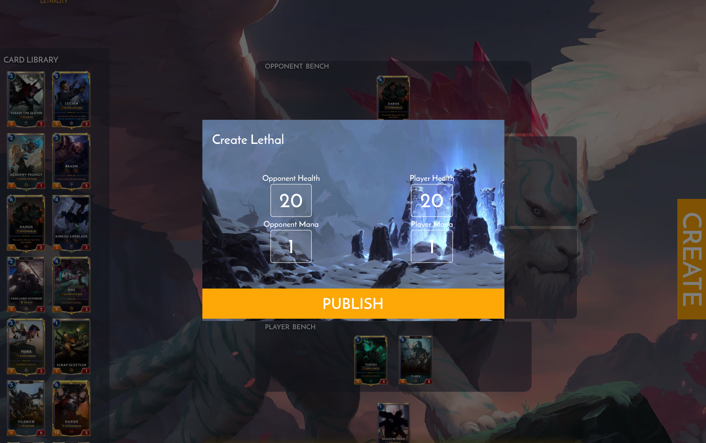
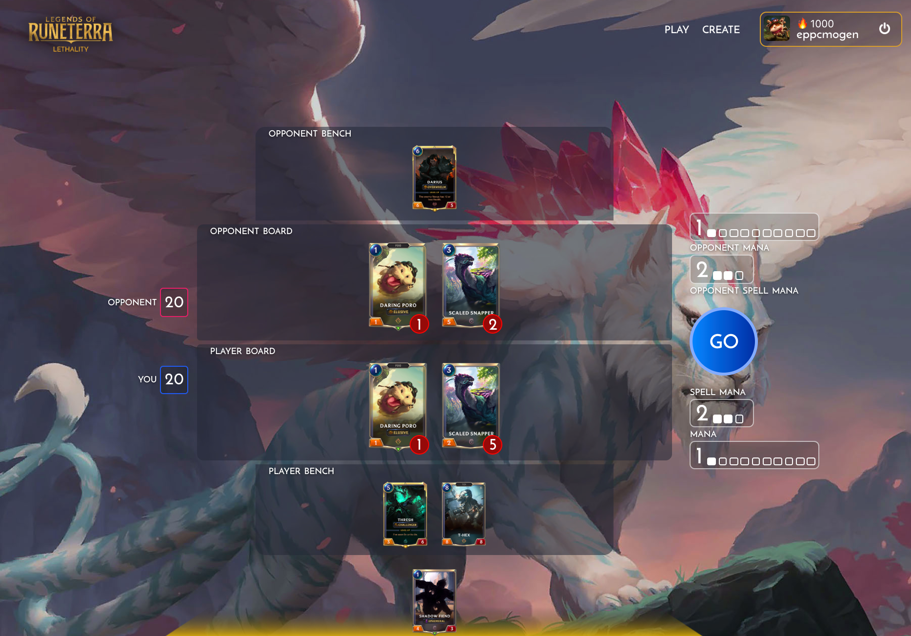
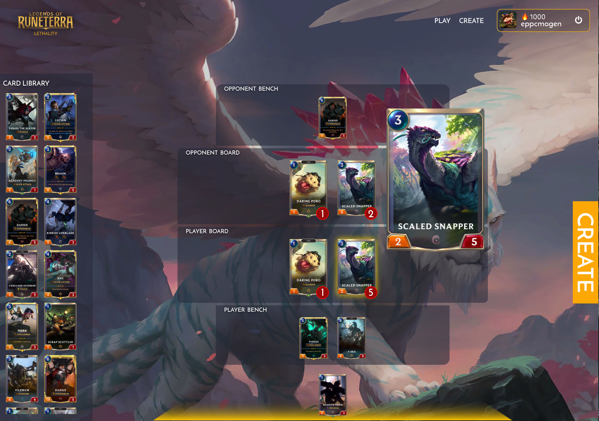

# LETHALITY
Lethality is a Legends of Runeterra puzzle solver. The idea is to find lethal from the given position on the board. 

Lethal puzzles put you in scenarios where you have the ability to end the game, the only problem is you have to end it yourself! Through a combination of spells, followers and champions, tactically find a way to bring your opponent's nexus down!

There are currently two modes:
  1) Puzzle Solving
  2) Puzzle Creation 
 
Create puzzles, and let others solve them! Increase your elo by completing puzzles. Get more elo when the puzzle is harder!

Lethal puzzles can help you spot game ending moves in the actual game! They train your eye to catch niche and unique interactions between cards to gain the upper hand

To launch the game, simply run: `docker-compose up`

The UI is live at `localhost:80`, and the backend API at `localhost:4433`

### Issues
- There might be a issue with the view model, if the play button is covered up when in the create menu, simply zoom out (Ctrl/Cmd & -). Small sizing error!
- Might be a CORS issue - to bypass on OSX:

`open -n -a /Applications/Google\ Chrome.app/Contents/MacOS/Google\ Chrome --args --user-data-dir="/tmp/chrome_dev_test" --disable-web-security`

